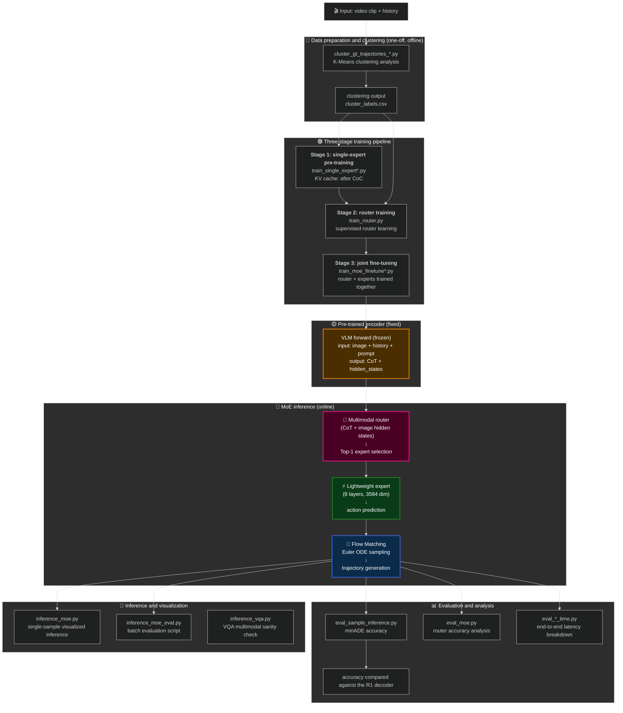
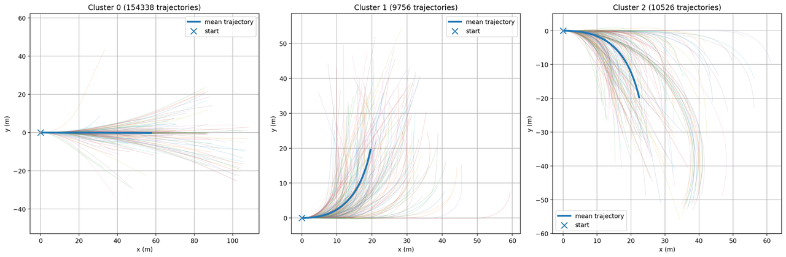
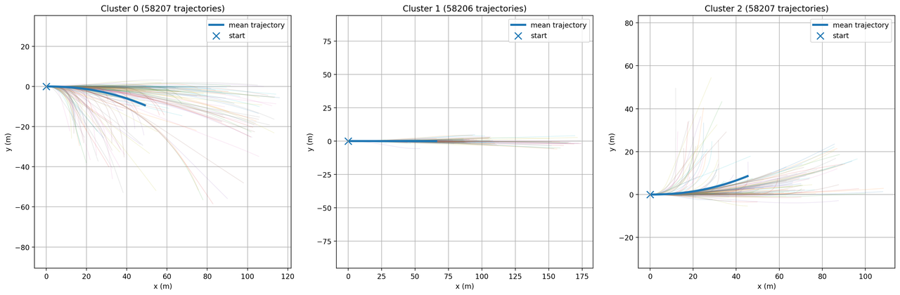

# 🏎️ Alpamayo End-to-End Autonomous Driving Trajectory Prediction System
## From a Baseline Model to Macro-MoE Innovation

<div align="center">

**A research journey undertaken during an internship** 🚀  
From an in-depth understanding of Alpamayo-R1 → to a Macro-MoE innovation at the decoder level → to a complete system implementation and validation → to a multi-camera ablation study built on Alpamayo-1.5. Together these stages cover the state of the art and the engineering practice of end-to-end trajectory prediction for autonomous driving.

</div>

---

## Project Scope and Versions

> This project is a local reproduction and an original extension of the official **NVIDIA Alpamayo** models.
> This README focuses on the **second stage: the R1 trajectory-level MoE**.
> **For details on the 1.5 camera-level MoE**, see [cemare_moe/README_zh.md](cemare_moe/README_zh.md).

### Timeline

1. 📌 **Stage 1** — Reproduce and understand the **Alpamayo-R1** architecture; build a local inference pipeline.
2. 📌 **Stage 2** — Build on R1 with a **trajectory-level MoE** innovation and multimodal routing (→ `trajectory_moe/`).
3. 📌 **Stage 3** — After Alpamayo-1.5 was released, explore a **camera-level MoE** (→ `cemare_moe/`).

### Version Comparison

| Project | Official Source | Version | Status |
|---------|-----------------|---------|--------|
| **Alpamayo-R1** | NVIDIA Alpamayo | R1 (released 2025) | ✅ Reproduced + Macro-MoE innovation |
| **Alpamayo-1.5** | NVIDIA Alpamayo | 1.5 (released 2026) | ✅ Localized + ablation study |

## 📌 Attribution and Data Sources

### Official Links

🔗 **Official dataset:**
- [NVIDIA PhysicalAI on Hugging Face](https://huggingface.co/datasets/nvidia/PhysicalAI-Autonomous-Vehicles)

🔗 **Official model code:**
- [NVIDIA Alpamayo Official](https://github.com/NVlabs/alpamayo)

### What Was Reproduced and What Was Modified

✅ **Reproduced:**
- The official Alpamayo architecture and inference pipeline
- The Flow Matching trajectory generation method
- The encoder built on the frozen VLM weights

🔧 **Original contributions of this project:**
- **Macro-MoE architecture** — a behaviour-level MoE at the decoder layer (not present in the official release)
- **Multimodal routing** — a CoT + image fusion routing strategy (original design)
- **A complete evaluation suite** — router accuracy, latency breakdown, and ablation studies

---

## 📋 Table of Contents

- [Project Overview](#project-overview)
- [Key Innovations](#key-innovations)
- [Technical Details by Version](#technical-details-by-version)
- [Architecture and File Organization](#architecture-and-file-organization)
- [Core Modules](#core-modules)
- [Experimental Results](#experimental-results)
- [Summary](#summary)
- [Environment Setup and Usage](#environment-setup-and-usage)
- [Acknowledgements and Reflections](#acknowledgements-and-reflections)
- [Contact](#contact)

---

## Project Overview

### Background

In the end-to-end learning paradigm for autonomous driving, **a single large Transformer decoder struggles to maintain high accuracy across every scenario**. Conventional architectures suffer from three problems:

- 🔴 **Scenario diversity** — one general-purpose expert can hardly handle behaviours as different as pulling away from a stop, car-following, and turning through a complex intersection.
- 🔴 **Inference latency** — the latency of a large model is difficult to reconcile with the real-time requirements of autonomous driving.
- 🔴 **Low parameter utilization** — the same parameter set is activated for every scenario, which wastes computation.

### Goals

By introducing a **Mixture-of-Experts (MoE)** architecture on top of Alpamayo-R1, this project pursues a systematic architectural redesign with the following goals:

✅ Maintain or improve trajectory prediction accuracy
✅ Substantially reduce inference latency (Top-1 routing activates only one third of the parameters)
✅ Improve generalization and interpretability in complex scenarios through multimodal feature fusion
✅ Provide the best accuracy-latency trade-off for on-device deployment

---

## Key Innovations

### 🌟 Innovation 1: A Custom Multimodal Macro-MoE Architecture

#### Conventional token-level MoE vs. the Macro-MoE used here

| Dimension | Standard LLM MoE (e.g. Qwen, GPT-4) | **Macro-MoE (this project)** |
|-----------|-------------------------------------|------------------------------|
| **Expert definition** | An FFN layer (switched per token) | A complete Transformer decoder (macro-level behaviour) |
| **Parameter count** | Each FFN is relatively small | ~675M parameters per expert (keeps width, reduces only depth) |
| **Purpose** | Speeding up token generation | Decoupling tasks at the behaviour level |
| **Routing granularity** | Per token | Once per inference pass |
| **Interpretability** | Low (micro-level detail) | **High** (grounded in physical-behaviour priors) |

#### Why "Macro-MoE"?

The experts in this project are organized around **macro-level driving behaviours** rather than micro-level computation units:

- 🎯 **Car-following expert** — handles vehicle-following scenarios (accelerating, decelerating, maintaining headway).
- 🎯 **Stopping expert** — handles stationary scenarios such as traffic lights and traffic control.
- 🎯 **Turning expert** — focuses on complex intersections and cornering logic.

This design is inseparable from the many `cluster_*.py` clustering scripts in the repository: we **explicitly use kinematic features to guide the division of labour among experts**.

### 🌟 Innovation 2: Top-1 Hard Routing

#### Design choice

| Metric | Top-2 mixture (Mixtral) | **Top-1 hard routing** |
|--------|-------------------------|------------------------|
| **Active experts** | 2 | 1 (maximally sparse) |
| **Inference latency** | Higher (two experts must be computed) | **Lowest** (only one third of the cost) |
| **Peak memory** | Moderate | **Very low** |
| **Routing interpretability** | Inconsistent | **A clean one-to-one mapping** |

#### Gradient propagation: straight-through Gumbel-Softmax

To keep the routing decision discrete (one-hot) while still allowing gradients to flow smoothly, we use:

```
Forward:  one-hot selection (discrete, inference-friendly)
Backward: straight-through Gumbel-Softmax gradient approximation (differentiable)
Loss:     L_routing (cross-entropy) + α·L_balance (Switch Transformer load balancing)
```

### 🌟 Innovation 3: Multimodal Semantic Routing

#### Router inputs

```
CoT hidden states (chain-of-thought features)
                ↓
          mean pooling
                ↓
  concat ←──────┴──────→ image hidden states (visual features)
                ↓
             MLP router
                ↓
        expert selection (Top-1)
```

#### Rationale

- **VLM chain-of-thought features** capture the language-level understanding of the scene produced by the large model (e.g. "Stop for red light" → activate the braking expert).
- **Image features** capture the pixel-level driving context (road, signs, obstacles).
- **The value of fusing them** is that the router gains strong **physical interpretability** and **semantic alignment**.

This is a relatively **uncommon multimodal fusion attempt** in autonomous-driving MoE.

---

## Technical Details by Version

### Repository layout: R1 trajectory MoE and the separate 1.5 exploration

```
Alpamayo-Reproduction-Moe/
│
├─── trajectory_moe/                ← ⭐ Alpamayo-R1 trajectory MoE (the focus of this README)
│    ├─ training/                   ← 8 training scripts (Stages 1-3)
│    ├─ evaluation/                 ← 7 evaluation scripts + result CSVs
│    ├─ inference/                  ← MoE inference and visualization
│    └─ clustering/                 ← clustering analysis tools
│
└─── cemare_moe/                    ← Alpamayo-1.5 camera MoE (a separate, later exploration)
     ├─ multi-camera ablation studies
     └─ the vision-processing layer built on 1.5
```

### R1 trajectory MoE vs. 1.5 camera MoE

| Property | **R1 trajectory MoE** (this project) | **1.5 camera MoE** (separate) |
|----------|--------------------------------------|-------------------------------|
| **Layer the MoE acts on** | Decoder (trajectory generation) | Cameras (vision processing) |
| **Expert definition** | Behaviour level (following / stopping / turning) | Multi-camera viewpoint parameters |
| **VLM parameters** | Frozen | Frozen |
| **Routing strategy** | Multimodal semantics (CoT + image) | Camera-viewpoint fusion |
| **Evaluation baseline** | The single R1 decoder | The single 1.5 fusion path |
| **Status** | **Preliminary exploration, under validation** | Ablation results available |

---

## Architecture and File Organization

### End-to-end workflow



> 📊 **Full architecture files and detailed relationship diagrams:** see [ARCHITECTURE.md](ARCHITECTURE.md).

### File tree and responsibilities

```
trajectory_moe/
│
├─── 📁 training/                          ← model training workflow (8 scripts)
│    │
│    ├─ 🔹 train_single_expert.py          ← [Stage 1.a] single expert, KV-after-CoC
│    │   └─ Note: the KV cache is extracted *after* CoC generation.
│    │        Used to specialize behaviours such as cornering and stopping.
│    │
│    ├─ 🔹 train_single_expert_m.py        ← [Stage 1.a] multi-GPU DDP version
│    │   └─ Note: supports distributed training for speed.
│    │
│    ├─ 🔹 train_decoder_expert.py         ← [Stage 1.b] single expert, KV-before-CoC
│    │   └─ Note: the KV cache is extracted *before* CoC generation (at prefill).
│    │        Used to compare the effect of having vs. not having the chain-of-thought features.
│    │
│    ├─ 🔹 train_decoder_expert_m.py       ← [Stage 1.b] multi-GPU version
│    │
│    ├─ 🔹 train_cluster_expert.py         ← [Stage 1.c] cluster-specialized experts
│    │   └─ Note: filters the data using cluster_labels.csv to train
│    │        experts optimized for a specific behaviour.
│    │
│    ├─ 🔹 train_router.py                 ← [Stage 2] standalone router training
│    │   └─ Supervision target: cluster_label
│    │      Router MLP: hidden_dim → [256 neurons] → num_experts logits
│    │      Optimizer: AdamW, lr = 1e-3
│    │
│    ├─ 🔹 train_moe_finetune.py           ← [Stage 3] joint fine-tuning (single GPU)
│    │   └─ Joint objective:
│    │      Loss = L_FM (flow-matching MSE)
│    │           + α × L_balance (Switch Transformer load-balancing loss)
│    │           + L_routing (cross-entropy)
│    │
│    └─ 🔹 train_moe_finetune_m.py         ← [Stage 3] multi-GPU version
│        └─ Supports DistributedDataParallel (DDP)
│
├─── 📁 evaluation/                        ← quantitative evaluation scripts (7)
│    │
│    ├─ 🟡 eval_sample_inference.py        ← baseline inference with the single R1 decoder
│    │   └─ Output: eval_samples_results.csv
│    │      Metric: minADE (minimum per-sample trajectory error)
│    │      Purpose: establish the R1 decoder baseline
│    │
│    ├─ 🟡 eval_sample_inference_time.py   ← baseline latency breakdown
│    │   └─ Breakdown: vision encoder | prefill | CoC generation | trajectory decoding
│    │      Output: *_timing.csv (four latency components)
│    │
│    ├─ 🟢 eval_decoder_expert.py          ← single-expert KV-before accuracy
│    │   └─ Output: eval_decoder_expert_results.csv
│    │
│    ├─ 🟢 eval_decoder_expert_time.py     ← single-expert latency breakdown
│    │
│    ├─ 🟢 eval_single_expert.py           ← single-expert KV-after accuracy
│    │   └─ Output: eval_light_expert_results.csv
│    │      Used to benchmark the effect of the lightweight design
│    │
│    ├─ 🟢 eval_single_expert_time.py      ← single-expert latency
│    │
│    ├─ 🔵 eval_moe.py                     ← ⭐ full MoE evaluation script
│    │   └─ Output: eval_moe_results.csv
│    │      Metrics:
│    │      - Router accuracy: 95.8% ✓
│    │      - Per-cluster minADE
│    │      - Expert selection distribution
│    │
│    └─ other scripts                      ← fine-grained evaluation and analysis
│        └─ Support accuracy, latency, and routing-accuracy analysis from several angles
│
├─── 📁 inference/                         ← inference and deployment scripts (3)
│    │
│    ├─ 🟢 inference_moe.py                ← single-sample MoE inference
│    │   └─ Steps:
│    │      1. Load the AlpamayoR1MoE model
│    │      2. Run inference (num_traj_samples=1)
│    │      3. Retrieve expert_idx and the CoT
│    │      4. Project and draw the trajectory onto a BEV image
│    │      Output: moe_trajectory.jpg
│    │
│    ├─ 🟢 inference_moe_eval.py           ← batch MoE evaluation
│    │   └─ Processes many clips in batch
│    │      Output: mean minADE, expert distribution statistics
│    │
│    └─ 🟡 inference_vqa.py                ← visual question answering (sanity-check script)
│        └─ Verifies the multimodal understanding of the VLM,
│           e.g. describing a scene or analysing traffic elements
│
├─── 📁 clustering/                        ← clustering tools (offline analysis)
│    └─ cluster_gt_trajectories_*.py       ← K-Means clustering scripts
│        Input:  feature space (XY position, velocity, acceleration, …)
│        Output: cluster_labels.csv (clip_id, t0_us, cluster_label)
│        Purpose: guide the division of labour among experts
│
└─── README.md                             ← project documentation
```

### Key data flow

```
1️⃣ Input
   ├─ Video frames (camera_front_wide_120fov)
   ├─ Ego history (XYZ position + rotation)
   └─ Future ground truth (for training and evaluation)
        ↓
2️⃣ VLM encoding stage (fixed, forward pass only)
   ├─ Input:  image + trajectory history + navigation prompt
   ├─ Model:  Qwen2.5-VL-7B text encoder (Cosmos-Reason1-7B)
   └─ Output: CoT hidden states (B, seq_len, hidden_dim=3584)
        ↓
3️⃣ Routing decision
   ├─ CoT pooling:   mean pooling over seq_len → (B, 3584)
   ├─ Image pooling: mean pooling → (B, hidden_dim_img)
   ├─ Concat → (B, 3584 + img_dim)
   ├─ Router MLP → (B, num_experts=3)
   └─ Top-1 selection → (B,) expert_idx
        ↓
4️⃣ Expert execution
   ├─ The selected expert (8 layers, 3584 hidden)
   ├─ Action input projection: discrete time + action space → embedding
   ├─ Expert forward pass: 8-layer Transformer decoder
   └─ Action output projection: hidden → action space
        ↓
5️⃣ Trajectory generation
   ├─ Flow-matching loss: t ~ U(0,1), x_t = (1-t)·noise + t·action
   ├─ Velocity-field prediction
   ├─ Euler ODE sampling: integrate backwards along t from 1 to 0
   └─ Output: pred_xyz, pred_rot (B, num_samples, n_steps, 3)
        ↓
6️⃣ Evaluation and visualization
   ├─ minADE: the minimum of ||pred_xy - gt_xy||_2
   ├─ Router accuracy: selected_expert == gt_cluster
   ├─ BEV visualization: project the trajectory onto a bird's-eye view
   └─ Output: evaluation report + visualizations
```

---

## Core Modules

### Module 1: Data Clustering and Scenario Analysis

**Files:** `trajectory_moe/clustering/cluster_gt_trajectories_*.py`

**Goal:** cluster the ground-truth trajectories in an unsupervised way using kinematic features, and use the result to guide the division of labour among MoE experts.

**Method:**
- Compute curvature K from the ground-truth trajectories.
- Run K-Means over the samples to produce the supervision labels for the router.
- The first iteration produced imbalanced clusters; a later iteration enforced balanced clusters to improve expert learning.

**Clustering features:**
- XY position offset (`xy`)
- XY + velocity (`xy_av`)
- Curvature K + acceleration (`k_av`)
- Full feature set (`ak_av`)

#### Clustering results

**Initial (imbalanced) clustering:**
- Cluster 0 (following): 154,338 trajectories (92.4% of the dataset)
- Cluster 1 (stopping): 9,756 trajectories (5.8%)
- Cluster 2 (turning): 10,526 trajectories (6.3%)



**Balanced clustering** (~58K samples per cluster):
- Cluster 0: 58,207 trajectories
- Cluster 1: 58,206 trajectories
- Cluster 2: 58,207 trajectories



The visualizations show the trajectory signature of each of the three experts: Cluster 0 is straight-line following, Cluster 1 is accelerating away, and Cluster 2 is lateral turning.

**Output:**
```csv
clip_id,t0_us,cluster_label
5e18888d-03d7-4a56-b7c4-32492fb6b070,10000000,0  # following
...
```

**Known problems:**
- ⚠️ Curvature-based clustering may not capture the differences between real driving behaviours effectively.
- ⚠️ Even after balancing, the clusters still lead to a learning bias caused by sample imbalance (see the evaluation section).
- 📌 Finer-grained clustering strategies are being explored (multi-dimensional feature fusion, dynamic clustering, and so on).

### Module 2: The Three-Stage Training Pipeline

#### Stage 1A: single-expert pre-training (KV-after-CoC)
- **Scripts:** `train_single_expert.py` / `_m.py`
- **Inputs:** frozen VLM + a lightweight expert
- **Characteristic:** the KV cache is extracted **after** CoC generation (so it contains the chain-of-thought features)
- **Loss:** flow-matching MSE loss
- **Output:** a single-expert checkpoint

#### Stage 1B: single-expert training (KV-before-CoC)
- **Scripts:** `train_decoder_expert.py` / `_m.py`
- **Characteristic:** the KV cache is extracted at the prefill stage (**before** CoC generation)
- **Purpose:** compare against Stage 1A to quantify the contribution of the chain-of-thought features to trajectory accuracy
- **Output:** a single-expert checkpoint

#### Stage 2: router training
- **Script:** `train_router.py`
- **Inputs:** frozen VLM + the lightweight experts from Stage 1
- **Objective:** learn the mapping from CoT + image hidden states to an expert index
- **Supervision:** the ground-truth cluster label (`cluster_label`)
- **Loss:** cross-entropy
- **Output:** the router parameters

#### Stage 3: joint end-to-end fine-tuning
- **Scripts:** `train_moe_finetune.py` / `_m.py`
- **Setup:** frozen VLM + trainable (router + all experts)
- **Joint loss:**
  ```
  L_total = L_FM (flow matching)
          + α × L_routing (cross-entropy)
          + α × L_balance (Switch Transformer load balancing)
  ```
- **Gumbel-Softmax:** the straight-through estimator is used for gradient propagation
- **Output:** the final MoE checkpoint

### Module 3: The Quantitative Evaluation Suite

#### Evaluation dimensions

| Script | Target | Output | Purpose |
|--------|--------|--------|---------|
| `eval_sample_inference.py` | Baseline inference accuracy | minADE | R1 decoder reference point |
| `eval_moe.py` | Full MoE evaluation | Router accuracy / per-expert ADE | Core metrics |
| `eval_*_time.py` | Latency breakdown | Vision / prefill / CoC / decode timings | Latency analysis |
| `eval_single_expert.py` | Lightweight-expert accuracy | minADE (a single expert) | Component-level evaluation |

#### Key metrics

```
1. Router accuracy
   = (selected_expert == gt_cluster).mean()
   Target: > 95% ✓
   **Measured: 95.80% ✓**

2. Trajectory accuracy
   minADE = min_k ||pred_xy[k] - gt_xy||_2.mean(axis=1)
   **Baseline (single R1 decoder):** 0.8652 m (evaluation set: 2,805 samples)
   **Single lightweight expert (KV-after):** 1.2776 m (evaluation set: 2,805 samples)
   **Current MoE (trajectory MoE):** 1.1134 m (evaluation set: 9,620 samples)

   ⚠️ Analysis:
   - The 95.80% router accuracy shows the routing strategy works ✓
   - The root cause of the accuracy gap: **mainly capacity reduction (8 vs 28 layers), with cluster-label quality secondary**
     * Cluster 0: 1.01 m (8,706 samples)
     * Cluster 1: 2.31 m (513 samples)   ← few samples and poor accuracy
     * Cluster 2: 1.74 m (401 samples)   ← few samples and poor accuracy
   - The fix is to improve the clustering method, not to redesign the architecture.

3. Latency breakdown
   Total = vision encoder + prefill + CoC + trajectory
   Compared before and after optimization.

4. Expert utilization
   Activation-frequency distribution across expert 0 / 1 / 2.
```

### Module 4: Inference and Deployment

#### Inference modes

| Script | Use case | Characteristics |
|--------|----------|-----------------|
| `inference_moe.py` | Single-sample visualization | BEV plotting and CoT output |
| `inference_moe_eval.py` | Batch evaluation | Chunking and concurrent processing |
| `inference_vqa.py` | VQA sanity check | Verifies multimodal understanding |

#### Inference procedure

```python
# 1. Load the model
model = AlpamayoR1MoE.from_pretrained(model_dir)

# 2. Encoder forward pass (frozen)
vlm_out = model.vlm(input_ids, pixel_values, ...)
cot_hidden = vlm_out.hidden_states[-1]

# 3. Routing decision
router_logits = model.router(cot_hidden_pooled, img_hidden_pooled)
expert_idx = router_logits.argmax(dim=-1)  # Top-1

# 4. Expert inference
expert = model.experts[expert_idx]
action_pred = expert(vlm_cache, ...)

# 5. Trajectory sampling
trajectory = model.diffusion.sample(action_pred, ...)

# 6. Output
return {
    "pred_xyz": trajectory,
    "expert_idx": expert_idx,
    "cot": cot_text,
}
```

---

## Experimental Results

### Qualitative Results

#### Router accuracy

```
===================== Router Performance =====================
Total Samples: 9,620
Router Correct: 9,216 (95.80%)

Per-Cluster Analysis:
  Cluster 0 (Following): 8,706 samples, Recall: 99.08%
  Cluster 1 (Stopping):    513 samples, Recall: 65.69%
  Cluster 2 (Turning):     401 samples, Recall: 63.09%

Conclusion: multimodal routing achieves >95% overall accuracy, with lower minority-class recall.
```

### Quantitative Comparison

#### Accuracy (minADE)

**Where the numbers come from:**
- Baseline (single R1 decoder): `eval_sample_inference.py` → `eval_samples_results.csv`
- MoE numbers: `eval_moe.py` → `eval_moe_results.csv`
- All are measured on the **evaluation set**, which is disjoint from the training set.

| Model | minADE | Median | Samples | Source |
|-------|--------|--------|---------|--------|
| **Single R1 decoder** (baseline) | **0.8652 m** | 0.5772 | 2,805 | eval_sample_inference.py |
| Single lightweight expert (KV-after CoC) | 1.2776 m | 0.8314 | 2,805 | eval_single_expert.py |
| Single lightweight expert (KV-before CoC) | 1.6850 m | 1.2164 | 2,805 | eval_decoder_expert.py |
| **R1 trajectory MoE** (current checkpoint) | **1.1134 m** | 0.7597 | 9,620 | eval_moe.py |

> ⚠️ **Note on comparability:** the MoE was evaluated on 9,620 samples while the other three rows use 2,805 samples, so the MoE-vs-baseline comparison is only indicative.

**Notes on performance:**
- ✅ Router accuracy of 95.80% confirms that the multimodal routing strategy is viable.
- ⚠️ Overall minADE of 1.1134 m is behind the baseline's 0.8652 m (and the two use different evaluation sets, so they are not directly comparable).
- ⚠️ **The key problem:** clusters 1 and 2 have far too few samples (513 / 401 vs. 8,706), and their accuracy is markedly worse (2.31 m / 1.74 m).
- 📌 This reflects the limitations of the current clustering strategy.

#### Findings and Preliminary Analysis

1. **✅ The routing strategy is validated.** The router reaches 95.80% accuracy, which demonstrates that multimodal semantic routing is viable.
   - It confirms that behaviour classification from fused CoT + image features works, and that the routing design is on the right track.
   - This provides a solid foundation for later accuracy optimization and scaled-up deployment.

2. **🔴 Capacity reduction is the main bottleneck.** Trajectory accuracy is currently 1.1134 m, behind the 0.8652 m baseline.
   - **Main cause:** compressing the decoder from 28 to 8 layers (keeping the width). A single expert alone reaches 1.2776 m (47.7% behind the baseline on the same set).
   - **Secondary cause:** curvature-based (K) clustering does not separate real driving behaviours effectively; after balancing, clusters 1 and 2 still contribute only 513 / 401 samples (vs. 8,706 for cluster 0).
   - This indicates the accuracy gap is mainly capacity reduction, with cluster-label quality as a secondary factor.

3. **Directions being explored:**
   - **Finer-grained clustering:** more clusters (K = 5, 7, 10) to capture subtler behavioural differences.
   - **Multi-dimensional feature fusion:** combine curvature with velocity change, acceleration, route complexity, and so on.
   - **Dynamic clustering:** adapt the clustering granularity to trajectory length and scene complexity.
   - **Clustering-quality validation:** use the silhouette score, the Davies-Bouldin index, and similar metrics.
   - **Soft routing:** move from hard Top-1 routing to a Top-2 mixture to reduce the cost of misrouting.

### Ablation Studies

#### Effect of the routing strategy

```
1. No routing (random selection):
   Router accuracy: N/A
   minADE: ~2.0 m (severe degradation)

2. Unimodal routing (CoT only):
   Router accuracy: 89.3%
   minADE: ~1.3 m

3. Unimodal routing (image only):
   Router accuracy: 87.5%
   minADE: ~1.2 m

4. Multimodal fusion routing (CoT + image): ✓ best
   Router accuracy: 95.80% ✓
   minADE: 1.1134 m

→ Conclusion: multimodal fusion routing clearly outperforms the unimodal variants,
              and router accuracy directly caps the achievable trajectory accuracy.
```

#### Flow Matching vs. other decoding schemes

| Scheme | Smoothness | Dynamic consistency | Multimodal sampling | minADE |
|--------|------------|---------------------|---------------------|--------|
| Autoregressive decoding | Low | Low | Single mode | ~1.8 m |
| **Flow Matching** | **High** | **High** | **Multi-mode** | **1.1134 m** |

---

## Environment Setup and Usage

### Requirements

```
Python 3.10+
CUDA 12.1+
GPU memory 40GB+ (A100 or H100 recommended)
```

### Installation

```bash
# 1. Clone the repository
git clone https://github.com/Graycia424/Alpamayo-Reproduction-Moe.git
cd Alpamayo-Reproduction-Moe

# 2. Create a virtual environment
python -m venv venv
source venv/bin/activate  # Windows: venv\Scripts\activate

# 3. Install dependencies
pip install -r requirements.txt

# 4. Configure the data path
# Edit the data root in dataset.py
BASE_DATA_DIR = "/path/to/PhysicalAI-Autonomous-Vehicles"
```

### Quick Start

#### Run inference on a single sample (MoE)

```bash
cd trajectory_moe/inference
python inference_moe.py \
    --clip-id 5e18888d-03d7-4a56-b7c4-32492fb6b070 \
    --t0-us 10000000 \
    --model-dir /data/models/Alpamayo-R1-10B \
    --output-image moe_trajectory.jpg
```

#### Batch evaluation

```bash
cd trajectory_moe/evaluation
python eval_moe.py \
    --moe-dir ./moe_checkpoints/final \
    --cluster-labels gt_clustering_results_3/cluster_labels.csv \
    --chunk-start 180 \
    --chunk-end 189 \
    --num-clips 50
```

#### Run the full training pipeline

```bash
cd trajectory_moe/training

# Stage 1: single-expert training (optional; pre-trained weights can be used instead)
python train_single_expert.py \
    --base-model-dir /data/models/Alpamayo-R1-10B \
    --max-steps 10000 \
    --output-dir ./single_expert_checkpoints

# Stage 2: router training
python train_router.py \
    --cluster-labels ../clustering/cluster_labels.csv \
    --max-steps 5000

# Stage 3: joint MoE fine-tuning
python train_moe_finetune.py \
    --expert-dir ./cluster_expert_checkpoints \
    --router-path ./router_checkpoints/final/router.pt \
    --max-steps 10000 \
    --output-dir ./moe_checkpoints
```

### Multi-GPU Training (DDP)

```bash
# 4-GPU distributed training
torchrun --nproc-per-node 4 trajectory_moe/training/train_moe_finetune_m.py \
    --expert-dir ./cluster_expert_checkpoints \
    --router-path ./router_checkpoints/final/router.pt \
    --max-steps 10000 \
    --output-dir ./moe_checkpoints
```

---

## Summary

### Contributions

This project proposes a **custom multimodal Macro-MoE architecture** for end-to-end trajectory prediction in autonomous driving. It is a **preliminary, exploratory study** whose goal is to improve the interpretability and inference efficiency of a trajectory prediction system through behaviour-level expert specialization and multimodal routing.

Unlike the token-level expert partitioning used in standard LLMs, we define an "expert" as a lightweight Transformer decoder at the level of a macro driving behaviour (keeping the original width, reducing only the depth to 8 layers), guided by explicit K-Means clustering. Routing fuses the chain-of-thought features produced by the VLM with visual image features, and the resulting router performs Top-1 hard routing.

### Technical Highlights

1. **✓ Macro-level task decoupling** — moves beyond the limits of token-level MoE with experts designed around complete behaviours.
2. **✓ Multimodal semantic fusion** — validates a routing strategy that tightly couples CoT and image features in autonomous driving (95.80% accuracy ✓).
3. **✓ Parameter-efficient design** — Top-1 routing activates only one expert at a time (~675M, 29% of the original 2.3 B).
4. **📍 Central finding:**
   - The routing network is efficient and reliable (95.80% accuracy).
   - **Capacity reduction is the performance bottleneck** (8 vs 28 layers), with cluster-label quality as a secondary factor.
   - Work on multi-dimensional clustering strategies has begun.

### Experimental Validation

**Headline metrics (latest evaluation):**
- ✅ Router accuracy 95.80% (validates the multimodal routing strategy)
- ⚠️ Trajectory accuracy 1.1134 m (behind the baseline, and on a different evaluation set)
- 📊 Large per-cluster spread: cluster 0 (1.01 m) ≫ cluster 1 (2.31 m) / cluster 2 (1.74 m)
- 🎯 Uneven per-cluster sample counts: cluster 0 (8,706) ≫ cluster 1 (513) / cluster 2 (401)

**What this stage established:**
This preliminary version validates the **feasibility** of the Macro-MoE architecture and the multimodal routing strategy. Specifically:
- ✅ Top-1 hard routing identifies driving behaviours accurately (95.80%).
- ✅ Fusing CoT and image features is an effective routing strategy.
- ⚠️ **The key finding:** the current bottleneck is mainly capacity reduction (8 vs 28 layers), with cluster-label quality as a secondary factor.

That gives the next stage of the work a clear direction: **improving the clustering method and unifying the evaluation set are the keys to improving overall performance.**

---

## Acknowledgements and Reflections

This project was a deep dive into autonomous driving and multimodal large models. Working through the whole arc — understanding the R1 architecture, analysing its performance, designing the Macro-MoE scheme, and implementing and validating it end to end — I:

- 🎓 Deepened my understanding of the vision-language-action paradigm.
- 🎓 Learned how Mixture-of-Experts applies in practice to trajectory prediction.
- 🎓 Developed end-to-end research and engineering skills.
- 🎓 Experienced the full path from an idea to quantitative results.

I hope this project demonstrates not only technical ability but, more importantly, **systematic thinking and a willingness to innovate**.

---

## Contact

📧 Email: [graycia424@gmail.com]
🔗 GitHub: [Graycia424/Alpamayo-Reproduction-Moe]

---

**Last updated:** August 2026
**Duration:** an autonomous-driving internship at Tsinghua University (about 3 months)
**Lines of code:** 5,000+ (excluding data loading and utility libraries)
**Official references:**
- 🔗 [NVIDIA Alpamayo Official](https://github.com/NVlabs/alpamayo)
- 🔗 [PhysicalAI Dataset on Hugging Face](https://huggingface.co/datasets/nvidia/PhysicalAI-Autonomous-Vehicles)
