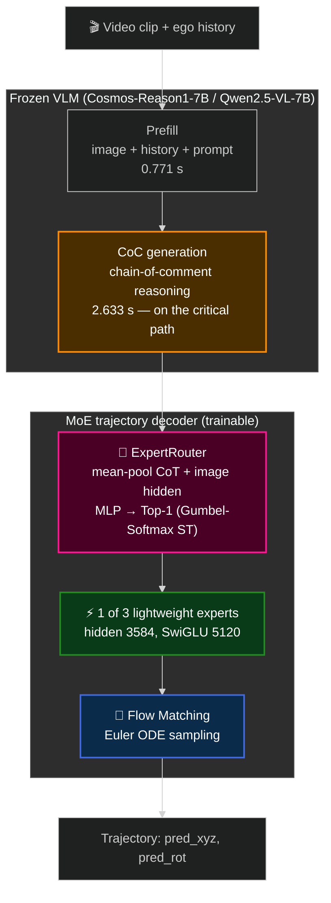

# 🏎️ Alpamayo Trajectory-MoE: A Preliminary Exploration

**English** · [中文](README_zh.md)

**Can a Mixture-of-Experts decoder replace the single large trajectory decoder in Alpamayo-R1?**

This repository is a local reproduction of NVIDIA's Alpamayo models plus an original experiment: replacing R1's single trajectory decoder with three lightweight behaviour-specialised experts and a multimodal router.

**Headline result: it does not beat the baseline — but the two were measured on different eval sets.** The MoE's 1.1134 m minADE (9,620 samples) versus the baseline's 0.8652 m (2,805 samples) is not a strict like-for-like comparison. The write-up below reports the trade-off honestly and digs into the intermediate ablations, which are more informative than the headline number.

---

## Contents

- [Results](#results)
- [What the numbers actually say](#what-the-numbers-actually-say)
- [Architecture](#architecture)
- [Repository layout](#repository-layout)
- [Data setup](#data-setup)
- [Usage](#usage)
- [What is verified and what is not](#what-is-verified-and-what-is-not)
- [Attribution](#attribution)

---

## Results

All numbers below are recomputed from the CSV files committed under `trajectory_moe/evaluation/`. Every claim in this README is reproducible from those files; anything that is an estimate rather than a measurement is labelled as such.

### Trajectory accuracy (minADE, lower is better)

| # | Configuration | KV cache source | minADE | Median | Samples |
|---|---------------|-----------------|--------|--------|---------|
| 1 | **Alpamayo-R1 baseline** — full decoder | after CoC | **0.8652 m** | 0.5772 | 2,805 |
| 2 | Single lightweight expert | after CoC | 1.2776 m | 0.8314 | 2,805 |
| 3 | Single lightweight expert | prefill, before CoC | 1.6850 m | 1.2164 | 2,805 |
| 4 | **Trajectory MoE** — 3 experts + router | after CoC | **1.1134 m** | 0.7597 | 9,620 |

> ⚠️ **Row 4 was evaluated on a different, 3.4× larger sample set than rows 1–3.** Cross-comparisons involving the MoE are therefore indicative, not rigorous. A matched-set re-run is the single most important piece of unfinished work in this repository.

Sources: `eval_samples_results.csv`, `eval_light_expert_results.csv`, `eval_decoder_expert_results.csv`, `eval_moe_results.csv`.

### Router behaviour (n = 9,620, from `eval_moe_results.csv`)

| Metric | Value |
|--------|-------|
| Overall accuracy | 95.80% (9,216 / 9,620) |
| **Majority-class baseline** (always predict cluster 0) | **90.50%** |
| **Balanced accuracy** (macro-averaged recall) | **75.96%** |
| Recall, cluster 0 (following) | 99.08% (8,626 / 8,706) |
| Recall, cluster 1 (stopping) | 65.69% (337 / 513) |
| Recall, cluster 2 (turning) | 63.09% (253 / 401) |

Confusion matrix (ground-truth cluster → expert actually selected):

|            | → expert 0 | → expert 1 | → expert 2 |
|------------|-----------:|-----------:|-----------:|
| **gt 0** (n=8,706) | 8,626 | 57 | 23 |
| **gt 1** (n=513)   | 165 | 337 | 11 |
| **gt 2** (n=401)   | 140 | 8 | 253 |

### Accuracy per ground-truth cluster

| Cluster | Samples | Share | minADE | Median |
|---------|--------:|------:|-------:|-------:|
| 0 — following | 8,706 | 90.5% | 1.0141 m | 0.7196 |
| 1 — stopping | 513 | 5.3% | 2.3077 m | 1.5512 |
| 2 — turning | 401 | 4.2% | 1.7419 m | 1.2804 |

### Cost of a routing mistake

| Routing outcome | Samples | minADE |
|-----------------|--------:|-------:|
| Router correct | 9,216 | 1.0562 m |
| Router wrong | 404 | 2.4188 m |

### Measured latency (n = 199 clips, seconds per clip)

| Stage | Full R1 pipeline | Prefill-KV expert (no CoC) |
|-------|-----------------:|---------------------------:|
| Vision encoder | 0.440 | 0.419 |
| Prefill | 0.771 | 0.765 |
| **CoC generation** | **2.633** | — (skipped) |
| Trajectory decoding | 1.837 | 1.626 |
| **Total** | **5.269** | **2.810** |

Sources: `eval_samples_inference_time_results_timing.csv`, `eval_decoder_expert_time_results_timing.csv`.

---

## What the numbers actually say

### 1. Chain-of-thought features are worth 0.41 m of ADE

Rows 2 and 3 of the results table use **the same expert architecture**. `train_single_expert.py` and `train_decoder_expert.py` declare a byte-identical `LIGHT_EXPERT_CFG`; the only difference is where the KV cache is taken from:

- **Row 2** takes it *after* the VLM has generated its chain-of-comment (CoC) reasoning → 1.2776 m
- **Row 3** takes it from the prefill pass, *before* CoC generation → 1.6850 m

Having the reasoning trace in the KV cache is therefore worth **0.407 m, a 24.2% reduction in minADE**, at a cost of 2.633 s per clip. This is the cleanest single finding in the repository and it is orthogonal to the MoE question.

### 2. The headline 95.80% router accuracy is mostly class imbalance

The evaluation set is 90.5% cluster 0. A constant classifier that always predicts "following" scores 90.50%, so the router's real contribution over a trivial baseline is **5.3 percentage points**, not 95.8.

Balanced accuracy is **75.96%**, and the confusion matrix shows why: the router recovers 99.1% of following samples but only 65.7% of stopping and 63.1% of turning samples. In both minority classes the dominant error is a fallback to expert 0 (165 and 140 samples respectively).

Since misrouted samples cost 2.29× more error (2.4188 m vs 1.0562 m), the minority-class recall — not the headline accuracy — is what caps this design.

### 3. This MoE design cannot save inference latency

The router consumes CoT hidden states (`ExpertRouter.forward` takes `cot_hidden` extracted from the VLM's generated tokens, see `alpamayo_r1/models/router.py` and `alpamayo_r1_moe.py:210`). **CoC generation therefore cannot be skipped** — it must complete before routing can happen at all.

CoC generation is 2.633 s of the 5.269 s baseline, i.e. 50% of end-to-end latency. The 2.810 s figure in the latency table comes from the prefill-KV path, which skips CoC entirely and consequently cannot route. Any latency advantage from the sparse Top-1 design is confined to the trajectory-decoding stage (1.837 s), and has not been measured for the MoE.

### 4. Why the MoE underperforms

Two effects compound, and the current evidence cannot fully separate them:

- **Capacity reduction.** Replacing the full R1 decoder (28 layers, ~2.3 B) with an 8-layer expert that keeps the width (hidden 3584, ~0.68 B) costs 47.7% on its own (row 1 → row 2), *before* any routing is involved. This is the larger of the two effects.
- **Cluster label quality.** The K-Means labels that supervise the router are derived from trajectory curvature, and the resulting classes are severely imbalanced (90.5 / 5.3 / 4.2). The two minority experts see too few samples, and their per-cluster minADE (2.31 m and 1.74 m) is roughly twice that of cluster 0.

Comparing row 2 to row 4 suggests routing recovers part of the capacity loss (1.2776 → 1.1134), but **those two rows use different evaluation sets**, so this should be treated as a hypothesis to test rather than a result.

### 5. What would need to happen next

1. **Re-run rows 1–3 on the same 9,620-sample set as row 4.** Nothing else in this list is worth doing before this comparison is valid.
2. **Fix the clustering.** Curvature alone does not separate driving behaviours cleanly. Candidates: multi-feature clustering (velocity change, acceleration, route complexity), more clusters (K = 5, 7, 10), and quantitative cluster-quality checks (silhouette, Davies-Bouldin).
3. **Address minority-class recall directly** — class-weighted routing loss, or a Top-2 soft mixture so a misroute degrades gracefully instead of costing 2.29×.
4. **Measure the MoE latency and memory** so the efficiency side of the trade-off has actual numbers.

---

## Architecture

### Inference path



The dependency worth noting: **the router sits downstream of CoC generation**, which is what makes the latency argument in section 3 above unavoidable.

### Expert configuration

Verbatim from `trajectory_moe/training/train_single_expert.py`:

```python
LIGHT_EXPERT_CFG = {
    "dtype": "bfloat16",
    "hidden_size": 3584,           # 保持原始宽度（不缩到 1024）
    "num_hidden_layers": 8,        # 只减层数 28 -> 8
    "intermediate_size": 5120,     # 保持原始中间层
}
```

The original R1 expert inherits the VLM backbone's layer count (**28 layers**, hidden 3584, from Cosmos-Reason1-7B → Qwen2.5-VL-7B-Instruct). This repo's lightweight expert **keeps the original width and reduces only the depth** — 28 → 8 layers — via `LIGHT_EXPERT_CFG`. The parameter savings comes from **sparse activation** (only 1 of 3 experts runs per inference), not from shrinking the hidden width.

The lightweight expert config (`LIGHT_EXPERT_CFG`):

| | This repo's lightweight expert |
|---|---:|
| hidden_size | 3584 (kept) |
| intermediate_size | 5120 (kept) |
| attention heads (KV heads) | 28 (4) |
| layers | 8 (28 → 8) |
| **per layer** | 84,417,792 |
| **per expert** | **675,345,920** (675.3 M) |

| MoE totals | Parameters |
|---|---:|
| 3 lightweight experts (stored) | 2,026,037,760 (2.03 B) |
| Router — `Linear(7168→1024) + SiLU + Linear(1024→3)` | 7,344,131 (7.34 M) |
| **Total stored** | **2,033,381,891 (2.03 B)** |
| **Active per inference (Top-1)** | **675.3 M ≈ 29.4% of the original 2.3 B** |

The official Alpamayo-R1 expert is **≈2.3 B parameters** per the paper and HF model card; The efficiency claim is the standard MoE trade-off: store three experts (~2.03 B total) but activate only one (~0.68 B, 29.4% of the original).

These counts are analytical and exclude `action_in_proj` / `action_out_proj` (~1 M per expert) and the deleted `embed_tokens` (`alpamayo_r1.py:94`). Reproduce them with `python trajectory_moe/param_count.py`.

### Routing

The router mean-pools the CoT and image hidden states from the VLM's last layer, concatenates them, and produces three gate logits. Training uses straight-through Gumbel-Softmax (hard forward, soft backward); inference uses `argmax`:

```
L_total = L_FM (flow-matching MSE)
        + L_routing (cross-entropy against the K-Means cluster label)
        + 0.01 × L_balance (Switch Transformer load balancing)
```

One implementation caveat, flagged in `alpamayo_r1_moe.py`: the image hidden states are approximated from the prefill portion captured in the first generation step, rather than extracted from a dedicated forward pass.

### Training pipeline

| Stage | Script | What trains | Notes |
|-------|--------|-------------|-------|
| 1a | `train_single_expert.py` (`_m.py` for DDP) | One lightweight expert | KV cache taken after CoC |
| 1b | `train_decoder_expert.py` (`_m.py`) | One lightweight expert | KV cache taken at prefill, before CoC |
| 1c | `train_cluster_expert.py` | One expert per cluster | Filters data by `cluster_labels.csv` |
| 2 | `train_router.py` | Router only | Supervised on cluster labels, AdamW lr=1e-3 |
| 3 | `train_moe_finetune.py` (`_m.py`) | Router + all experts jointly | VLM stays frozen throughout |

The VLM is frozen in every stage.

---

## Repository layout

```
.
├── alpamayo_r1/              # R1 model code (Apache-2.0, from NVIDIA) + MoE additions
│   └── models/
│       ├── alpamayo_r1_moe.py    # ← MoE variant (original)
│       ├── router.py             # ← ExpertRouter (original)
│       └── moe_loss.py           # ← load-balancing loss (original)
├── alpamayo1_5/              # Alpamayo-1.5 model code (Apache-2.0, from NVIDIA)
├── trajectory_moe/           # ⭐ the R1 trajectory-MoE experiment
│   ├── clustering/           #   6 K-Means variants + planning script
│   ├── training/             #   8 training scripts (stages 1-3)
│   ├── evaluation/           #   7 evaluation scripts + their result CSVs
│   ├── inference/            #   3 inference / visualisation scripts
│   └── plans/                #   design notes
├── cemare_moe/               # separate Alpamayo-1.5 multi-camera ablation
├── notebooks/                # inference / VQA / navigation notebooks
├── parquet/                  # dataset shards — NOT tracked, see "Data setup"
└── hfd.sh                    # dataset download helper
```

The three files marked "original" under `alpamayo_r1/models/` are this project's contribution; everything else in `alpamayo_r1/` and `alpamayo1_5/` is NVIDIA's Apache-2.0 code.

---

## Data setup

The dataset index and calibration shards are **not committed** to this repository — they are redistributable parts of the NVIDIA PhysicalAI dataset and are better fetched from the source. Download them before running anything:

```bash
./hfd.sh nvidia/PhysicalAI-Autonomous-Vehicles --dataset
```

You need, at minimum:

```
parquet/clip_index.parquet                      # clip index (~11 MB)
parquet/camera_intrinsics.chunk_0000.parquet    # calibration
parquet/sensor_extrinsics.chunk_0000.parquet    # calibration
notebooks/clip_ids.parquet                      # clip list used by the notebooks
```

Then point `BASE_DATA_DIR` in `dataset.py` at your local copy of the dataset.

`features.csv` in the repository root is a small manifest describing where each dataset feature lives; it is configuration, not data, and is tracked.

---

## Usage

### Requirements

```
Python 3.10+ · CUDA 12.1+ · ~40 GB GPU memory for the 10B checkpoint
```

```bash
git clone https://github.com/Graycia424/Alpamayo-Reproduction-Moe.git
cd Alpamayo-Reproduction-Moe
python -m venv .venv && source .venv/bin/activate
pip install -r requirements.txt
```

### Single-sample MoE inference

```bash
python trajectory_moe/inference/inference_moe.py \
    --clip-id 5e18888d-03d7-4a56-b7c4-32492fb6b070 \
    --t0-us 10000000 \
    --model-dir /path/to/Alpamayo-R1-10B \
    --output-image moe_trajectory.jpg
```

### Batch evaluation

```bash
python trajectory_moe/evaluation/eval_moe.py \
    --moe-dir ./moe_checkpoints/final \
    --cluster-labels gt_clustering_results_3/cluster_labels.csv \
    --chunk-start 180 --chunk-end 189 --num-clips 50
```

### Training

```bash
# Stage 1 — one lightweight expert
python trajectory_moe/training/train_single_expert.py \
    --base-model-dir /path/to/Alpamayo-R1-10B \
    --max-steps 10000 --output-dir ./single_expert_checkpoints

# Stage 2 — router
python trajectory_moe/training/train_router.py \
    --cluster-labels ./cluster_labels.csv --max-steps 5000

# Stage 3 — joint fine-tuning
python trajectory_moe/training/train_moe_finetune.py \
    --expert-dir ./cluster_expert_checkpoints \
    --router-path ./router_checkpoints/final/router.pt \
    --max-steps 10000 --output-dir ./moe_checkpoints

# Multi-GPU: use the _m.py variants under torchrun
torchrun --nproc-per-node 4 trajectory_moe/training/train_moe_finetune_m.py ...
```

---

## What is verified and what is not

Being explicit about this, because it is the difference between a useful negative result and a misleading one.

**Measured, reproducible from committed CSV files:**

- Every minADE figure in the results table
- Router accuracy, balanced accuracy, confusion matrix, per-cluster breakdown
- The latency breakdown for the full R1 pipeline and the prefill-KV path

**Analytically computed, labelled as such above:**

- All parameter counts. The expert keeps the original width (hidden 3584) and reduces only the depth (8 layers), per `LIGHT_EXPERT_CFG`. Reproduce with `python trajectory_moe/param_count.py`.
- The ~29.4% active-parameter figure (sparse activation) follows from those counts.

**Not measured — deliberately absent rather than estimated:**

- MoE inference latency and peak memory. No timing run exists for the MoE path.
- Single-modality routing ablations (CoT-only, image-only). No script in `evaluation/` produces these, so no numbers are reported.
- Any comparison against autoregressive trajectory decoding.

**Known methodological weaknesses:**

- The MoE (9,620 samples) and the single-expert runs (2,805 samples) use different evaluation sets. Every cross-comparison involving row 4 inherits this caveat.
- 4 of the 9,624 rows in `eval_moe_results.csv` have an empty `min_ade` and are excluded from all statistics above.
- The cluster labels supervising the router are themselves unvalidated — no silhouette or stability analysis was run.

---

## Attribution

Model code under `alpamayo_r1/` and `alpamayo1_5/` is NVIDIA's, used under Apache-2.0:

- [NVIDIA Alpamayo](https://github.com/NVlabs/alpamayo)
- [PhysicalAI Autonomous Vehicles dataset](https://huggingface.co/datasets/nvidia/PhysicalAI-Autonomous-Vehicles)

Original to this project: the MoE decoder variant (`alpamayo_r1/models/alpamayo_r1_moe.py`), the multimodal router (`router.py`), the load-balancing loss (`moe_loss.py`), and everything under `trajectory_moe/` and `cemare_moe/`.

The separate Alpamayo-1.5 multi-camera ablation is documented in [cemare_moe/README.md](cemare_moe/README.md).

中文版见 [README_zh.md](README_zh.md)。

---

*Internship project, approximately 3 months. Last updated August 2026.*
