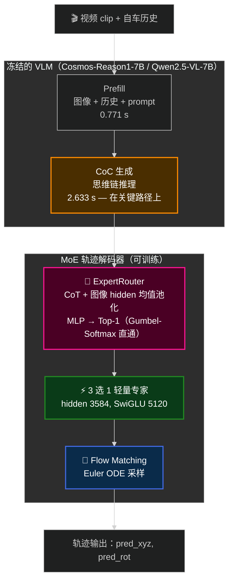

# 🏎️ Alpamayo 轨迹 MoE：一次初步探索

[English](README.md) · **中文**

**能不能用 Mixture-of-Experts 解码器替换 Alpamayo-R1 的单一大轨迹解码器？**

本仓库是 NVIDIA Alpamayo 系列模型的本地化复现，外加一个原创实验：把 R1 的单一轨迹解码器换成三个行为特化的轻量专家 + 一个多模态路由器。

**核心结论：没有跑赢基线——但两者评测集口径不同，不能直接相减。** MoE 的 1.1134 m（9,620 样本）对比基线的 0.8652 m（2,805 样本）不是严格可比。下面如实报告这个权衡，并分析原因——过程中的几组消融实验比结论本身更有信息量。

---

## 目录

- [实验结果](#实验结果)
- [这些数字说明了什么](#这些数字说明了什么)
- [架构](#架构)
- [仓库结构](#仓库结构)
- [数据准备](#数据准备)
- [使用方法](#使用方法)
- [哪些是实测、哪些不是](#哪些是实测哪些不是)
- [来源声明](#来源声明)

---

## 实验结果

以下数字全部由 `trajectory_moe/evaluation/` 下已提交的 CSV 重新算出。本 README 的每一条结论都可以用这些文件复现；凡是估算而非实测的，都明确标注。

### 轨迹精度（minADE，越低越好）

| # | 配置 | KV cache 来源 | minADE | 中位数 | 样本数 |
|---|------|--------------|--------|--------|--------|
| 1 | **Alpamayo-R1 基线** — 完整解码器 | CoC 之后 | **0.8652 m** | 0.5772 | 2,805 |
| 2 | 单个轻量专家 | CoC 之后 | 1.2776 m | 0.8314 | 2,805 |
| 3 | 单个轻量专家 | prefill，CoC 之前 | 1.6850 m | 1.2164 | 2,805 |
| 4 | **轨迹 MoE** — 3 专家 + 路由器 | CoC 之后 | **1.1134 m** | 0.7597 | 9,620 |

> ⚠️ **第 4 行的评测集跟第 1–3 行不是同一个，样本量是它们的 3.4 倍。** 所以任何牵涉 MoE 的横向比较都只是参考性的，不是严格结论。**在同一评测集上重跑 1–3 行，是本仓库最该补的一件事。**

数据来源：`eval_samples_results.csv`、`eval_light_expert_results.csv`、`eval_decoder_expert_results.csv`、`eval_moe_results.csv`。

### 路由器表现（n = 9,620，来自 `eval_moe_results.csv`）

| 指标 | 数值 |
|------|------|
| 总体准确率 | 95.80%（9,216 / 9,620） |
| **多数类基线**（永远预测 cluster 0） | **90.50%** |
| **平衡准确率**（宏平均召回） | **75.96%** |
| cluster 0（跟车）召回 | 99.08%（8,626 / 8,706） |
| cluster 1（停车）召回 | 65.69%（337 / 513） |
| cluster 2（转向）召回 | 63.09%（253 / 401） |

混淆矩阵（真值簇 → 实际被选中的专家）：

|            | → 专家 0 | → 专家 1 | → 专家 2 |
|------------|--------:|--------:|--------:|
| **gt 0**（n=8,706） | 8,626 | 57 | 23 |
| **gt 1**（n=513）   | 165 | 337 | 11 |
| **gt 2**（n=401）   | 140 | 8 | 253 |

### 分簇精度

| 簇 | 样本数 | 占比 | minADE | 中位数 |
|----|------:|-----:|-------:|-------:|
| 0 — 跟车 | 8,706 | 90.5% | 1.0141 m | 0.7196 |
| 1 — 停车 | 513 | 5.3% | 2.3077 m | 1.5512 |
| 2 — 转向 | 401 | 4.2% | 1.7419 m | 1.2804 |

### 路由错误的代价

| 路由结果 | 样本数 | minADE |
|---------|------:|-------:|
| 路由正确 | 9,216 | 1.0562 m |
| 路由错误 | 404 | 2.4188 m |

### 实测延迟（n = 199 个 clip，单位：秒/clip）

| 阶段 | 完整 R1 流水线 | prefill-KV 专家（跳过 CoC） |
|------|--------------:|---------------------------:|
| 视觉编码器 | 0.440 | 0.419 |
| Prefill | 0.771 | 0.765 |
| **CoC 生成** | **2.633** | —（跳过） |
| 轨迹解码 | 1.837 | 1.626 |
| **总计** | **5.269** | **2.810** |

数据来源：`eval_samples_inference_time_results_timing.csv`、`eval_decoder_expert_time_results_timing.csv`。

---

## 这些数字说明了什么

### 1. 思维链特征值 0.41 m 的 ADE

结果表第 2 行和第 3 行用的是**完全相同的专家架构**。`train_single_expert.py` 和 `train_decoder_expert.py` 里的 `LIGHT_EXPERT_CFG` 逐字节一致，唯一区别是 KV cache 从哪里取：

- **第 2 行**在 VLM 生成完 CoC 推理链**之后**取 → 1.2776 m
- **第 3 行**在 prefill 阶段、CoC 生成**之前**取 → 1.6850 m

也就是说，KV cache 里带上推理链，值 **0.407 m，minADE 降低 24.2%**，代价是每个 clip 多花 2.633 秒。这是本仓库里最干净的一个发现，而且跟 MoE 这个问题本身无关。

### 2. 95.80% 这个路由准确率，主要是类别不平衡撑起来的

评测集里 90.5% 都是 cluster 0。一个永远输出「跟车」的常数分类器就能拿 90.50%，所以路由器相对平凡基线的真实增益是 **5.3 个百分点**，不是 95.8。

平衡准确率只有 **75.96%**，混淆矩阵说明了原因：跟车样本能召回 99.1%，但停车只有 65.7%、转向只有 63.1%。两个少数类的主要错误形式都是退化到专家 0（分别漏了 165 和 140 个样本）。

考虑到路由错误的样本误差要高 2.29 倍（2.4188 m vs 1.0562 m），**真正卡住这个设计的是少数类召回，而不是那个总体准确率。**

### 3. 这个 MoE 设计在结构上就省不了延迟

路由器吃的是 CoT hidden states（`ExpertRouter.forward` 的入参 `cot_hidden` 提取自 VLM 生成的 token，见 `alpamayo_r1/models/router.py` 与 `alpamayo_r1_moe.py:210`）。**因此 CoC 生成无法跳过**——它必须先跑完，路由才可能发生。

CoC 生成占基线 5.269 s 中的 2.633 s，也就是端到端延迟的 50%。延迟表里那个 2.810 s 来自 prefill-KV 路径，它彻底跳过了 CoC，所以它也**没法做路由**。Top-1 稀疏设计能省的部分只局限在轨迹解码阶段（1.837 s），而这一段针对 MoE 并没有实测过。

### 4. MoE 为什么更差

两个因素叠加，且现有证据无法完全区分二者：

- **容量压缩。** 把完整 R1 解码器（28 层，约 2.3B）换成 8 层、保持宽度（hidden 3584，约 0.68B）的轻量专家，在**还没引入任何路由**的情况下就已经差了 47.7%（第 1 行 → 第 2 行）。这是两者中更大的一个。
- **聚类标签质量。** 监督路由器的 K-Means 标签来自轨迹曲率，得到的类别严重不平衡（90.5 / 5.3 / 4.2）。两个少数类专家见到的样本太少，其分簇 minADE（2.31 m 和 1.74 m）约为 cluster 0 的两倍。

第 2 行对比第 4 行，看起来路由挽回了一部分容量损失（1.2776 → 1.1134），但**这两行用的评测集不同**，所以这只能当作一个待验证的假设，不能当结论。

### 5. 下一步该做什么

1. **在第 4 行那个 9,620 样本集上重跑第 1–3 行。** 在这个比较成立之前，下面几件事都不值得先做。
2. **改聚类。** 只用曲率分不开真实驾驶行为。候选方案：多特征聚类（速度变化、加速度、路线复杂度）、增加簇数（K = 5, 7, 10）、加上聚类质量的定量检验（silhouette、Davies-Bouldin）。
3. **直接针对少数类召回下手**——按类别加权的路由损失，或改成 Top-2 软混合，让路由错误是平滑退化而不是直接付 2.29 倍代价。
4. **把 MoE 的延迟和显存实测出来**，让这个权衡的效率一侧也有真实数字。

---

## 架构

### 推理路径



值得注意的依赖关系：**路由器位于 CoC 生成的下游**，这正是上面第 3 节那个延迟结论无法回避的原因。

### 专家配置

以下直接摘自 `trajectory_moe/training/train_single_expert.py`：

```python
LIGHT_EXPERT_CFG = {
    "dtype": "bfloat16",
    "hidden_size": 3584,           # 保持原始宽度（不缩到 1024）
    "num_hidden_layers": 8,        # 只减层数 28 -> 8
    "intermediate_size": 5120,     # 保持原始中间层
}
```

原始 R1 专家继承 VLM 主干的层数（**28 层**，hidden 3584，来自 Cosmos-Reason1-7B → Qwen2.5-VL-7B-Instruct）。本仓库的轻量专家**保持原始宽度、只减深度**——28 → 8 层——通过 `LIGHT_EXPERT_CFG` 实现。参数节省来自**稀疏激活**（每次推理只跑 3 个专家里的 1 个），而不是缩 hidden 宽度。

轻量专家配置（`LIGHT_EXPERT_CFG`）：

| | 本仓库轻量专家 |
|---|---:|
| hidden_size | 3584（保持） |
| intermediate_size | 5120（保持） |
| 注意力头数（KV 头数） | 28（4） |
| 层数 | 8（28 → 8） |
| **单层** | 84,417,792 |
| **单个专家** | **675,345,920**（675.3 M） |

| MoE 汇总 | 参数量 |
|---|---:|
| 3 个轻量专家（存储） | 2,026,037,760（2.03 B） |
| 路由器 —— `Linear(7168→1024) + SiLU + Linear(1024→3)` | 7,344,131（7.34 M） |
| **总存储** | **2,033,381,891（2.03 B）** |
| **每次推理激活（Top-1）** | **675.3 M ≈ 原始 2.3 B 的 29.4%** |

官方 Alpamayo-R1 专家约 **23 亿参数**（论文 + HF 模型卡）；效率结论是标准的 MoE 权衡：存储三个专家（约 2.03 B 总量），但每次只激活一个（约 0.68 B，原版的 29.4%）。

以上是解析计算值，不含 `action_in_proj` / `action_out_proj`（每专家约 1 M），也不含被删除的 `embed_tokens`（`alpamayo_r1.py:94`）。复算：`python trajectory_moe/param_count.py`。

### 路由机制

路由器把 VLM 最后一层的 CoT hidden 和图像 hidden 分别均值池化、拼接，输出三个门控 logits。训练用直通式 Gumbel-Softmax（前向硬选、反向软梯度），推理用 `argmax`：

```
L_total = L_FM（Flow-Matching MSE）
        + L_routing（对 K-Means 簇标签的交叉熵）
        + 0.01 × L_balance（Switch Transformer 负载均衡）
```

一处实现上的注意事项，`alpamayo_r1_moe.py` 自己有注释标出：图像 hidden 是从生成第一步里捕获的 prefill 部分**近似**得到的，并非来自专门的前向计算。

### 训练流水线

| 阶段 | 脚本 | 训练对象 | 说明 |
|------|------|---------|------|
| 1a | `train_single_expert.py`（`_m.py` 为 DDP 版） | 单个轻量专家 | KV cache 取自 CoC 之后 |
| 1b | `train_decoder_expert.py`（`_m.py`） | 单个轻量专家 | KV cache 取自 prefill，CoC 之前 |
| 1c | `train_cluster_expert.py` | 每簇一个专家 | 按 `cluster_labels.csv` 过滤数据 |
| 2 | `train_router.py` | 仅路由器 | 用簇标签监督，AdamW lr=1e-3 |
| 3 | `train_moe_finetune.py`（`_m.py`） | 路由器 + 全部专家联合 | VLM 全程冻结 |

所有阶段 VLM 均保持冻结。

---

## 仓库结构

```
.
├── alpamayo_r1/              # R1 模型代码（Apache-2.0，来自 NVIDIA）+ MoE 扩展
│   └── models/
│       ├── alpamayo_r1_moe.py    # ← MoE 变体（原创）
│       ├── router.py             # ← ExpertRouter（原创）
│       └── moe_loss.py           # ← 负载均衡损失（原创）
├── alpamayo1_5/              # Alpamayo-1.5 模型代码（Apache-2.0，来自 NVIDIA）
├── trajectory_moe/           # ⭐ R1 轨迹 MoE 实验
│   ├── clustering/           #   6 个 K-Means 变体 + 规划脚本
│   ├── training/             #   8 个训练脚本（阶段 1-3）
│   ├── evaluation/           #   7 个评测脚本 + 结果 CSV
│   ├── inference/            #   3 个推理 / 可视化脚本
│   └── plans/                #   设计笔记
├── cemare_moe/               # 独立的 Alpamayo-1.5 多摄像头消融实验
├── notebooks/                # 推理 / VQA / 导航 notebook
├── parquet/                  # 数据集分片 —— 不纳入版本控制，见「数据准备」
└── hfd.sh                    # 数据集下载脚本
```

`alpamayo_r1/models/` 下标注「原创」的三个文件是本项目的贡献；`alpamayo_r1/` 和 `alpamayo1_5/` 中的其余部分均为 NVIDIA 的 Apache-2.0 代码。

---

## 数据准备

数据集索引和标定分片**没有**提交到本仓库——它们是 NVIDIA PhysicalAI 数据集可再分发的一部分，从源头拉取更合适。运行前请先下载：

```bash
./hfd.sh nvidia/PhysicalAI-Autonomous-Vehicles --dataset
```

至少需要以下文件：

```
parquet/clip_index.parquet                      # clip 索引（约 11 MB）
parquet/camera_intrinsics.chunk_0000.parquet    # 标定
parquet/sensor_extrinsics.chunk_0000.parquet    # 标定
notebooks/clip_ids.parquet                      # notebook 用的 clip 列表
```

然后把 `dataset.py` 里的 `BASE_DATA_DIR` 指向你本地的数据集路径。

仓库根目录的 `features.csv` 是一份描述各数据集特征存放位置的小清单，属于配置而非数据，因此纳入版本控制。

---

## 使用方法

### 环境要求

```
Python 3.10+ · CUDA 12.1+ · 跑 10B checkpoint 约需 40 GB 显存
```

```bash
git clone https://github.com/Graycia424/Alpamayo-Reproduction-Moe.git
cd Alpamayo-Reproduction-Moe
python -m venv .venv && source .venv/bin/activate
pip install -r requirements.txt
```

### 单样本 MoE 推理

```bash
python trajectory_moe/inference/inference_moe.py \
    --clip-id 5e18888d-03d7-4a56-b7c4-32492fb6b070 \
    --t0-us 10000000 \
    --model-dir /path/to/Alpamayo-R1-10B \
    --output-image moe_trajectory.jpg
```

### 批量评测

```bash
python trajectory_moe/evaluation/eval_moe.py \
    --moe-dir ./moe_checkpoints/final \
    --cluster-labels gt_clustering_results_3/cluster_labels.csv \
    --chunk-start 180 --chunk-end 189 --num-clips 50
```

### 训练

```bash
# 阶段 1 —— 单个轻量专家
python trajectory_moe/training/train_single_expert.py \
    --base-model-dir /path/to/Alpamayo-R1-10B \
    --max-steps 10000 --output-dir ./single_expert_checkpoints

# 阶段 2 —— 路由器
python trajectory_moe/training/train_router.py \
    --cluster-labels ./cluster_labels.csv --max-steps 5000

# 阶段 3 —— 联合微调
python trajectory_moe/training/train_moe_finetune.py \
    --expert-dir ./cluster_expert_checkpoints \
    --router-path ./router_checkpoints/final/router.pt \
    --max-steps 10000 --output-dir ./moe_checkpoints

# 多卡：用 _m.py 变体配合 torchrun
torchrun --nproc-per-node 4 trajectory_moe/training/train_moe_finetune_m.py ...
```

---

## 哪些是实测、哪些不是

这一节写明白，是因为它决定了这份工作是「一个有用的负结果」还是「一份误导人的报告」。

**实测，可由已提交的 CSV 复现：**

- 结果表里的每一个 minADE
- 路由准确率、平衡准确率、混淆矩阵、分簇细分
- 完整 R1 流水线与 prefill-KV 路径的延迟拆解

**解析计算，上文已明确标注：**

- 全部参数量。专家保持原始宽度（hidden 3584），只减深度到 8 层，见 `LIGHT_EXPERT_CFG`。复算：`python trajectory_moe/param_count.py`。
- 约 29.4% 的激活参数占比（稀疏激活）由上述参数量推出。

**未测量，宁可留白也不估算：**

- MoE 的推理延迟与峰值显存。MoE 路径没有任何计时结果。
- 单模态路由消融（仅 CoT / 仅图像）。`evaluation/` 下没有任何脚本能产生这两个数，因此不报告任何数值。
- 与自回归轨迹解码的对比。

**已知的方法学缺陷：**

- MoE（9,620 样本）与单专家实验（2,805 样本）用的评测集不同。所有牵涉第 4 行的横向比较都继承这个问题。
- `eval_moe_results.csv` 的 9,624 行中有 4 行 `min_ade` 为空，已从以上全部统计中排除。
- 监督路由器的簇标签本身未经验证——没有做过 silhouette 或稳定性分析。

---

## 来源声明

`alpamayo_r1/` 与 `alpamayo1_5/` 下的模型代码来自 NVIDIA，依 Apache-2.0 使用：

- [NVIDIA Alpamayo](https://github.com/NVlabs/alpamayo)
- [PhysicalAI Autonomous Vehicles 数据集](https://huggingface.co/datasets/nvidia/PhysicalAI-Autonomous-Vehicles)

本项目原创部分：MoE 解码器变体（`alpamayo_r1/models/alpamayo_r1_moe.py`）、多模态路由器（`router.py`）、负载均衡损失（`moe_loss.py`），以及 `trajectory_moe/` 和 `cemare_moe/` 下的全部内容。

独立的 Alpamayo-1.5 多摄像头消融实验见 [cemare_moe/README_zh.md](cemare_moe/README_zh.md)。

English version: [README.md](README.md)

---

*实习项目，历时约 3 个月。最后更新：2026 年 8 月。*
