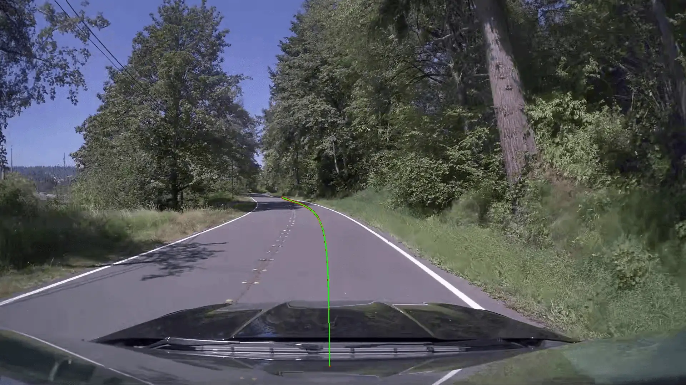
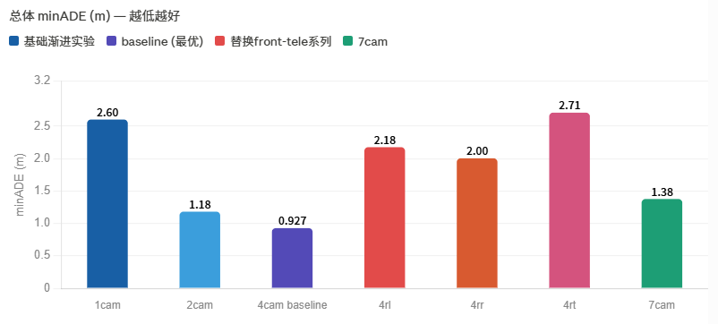
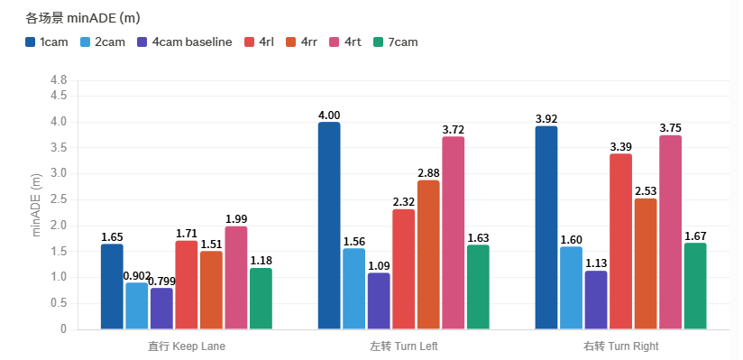
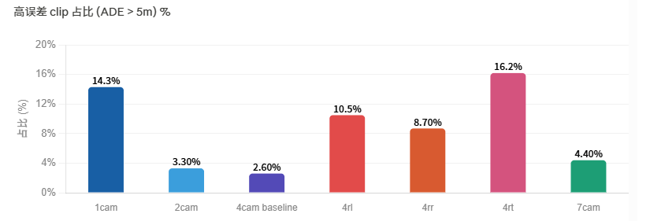
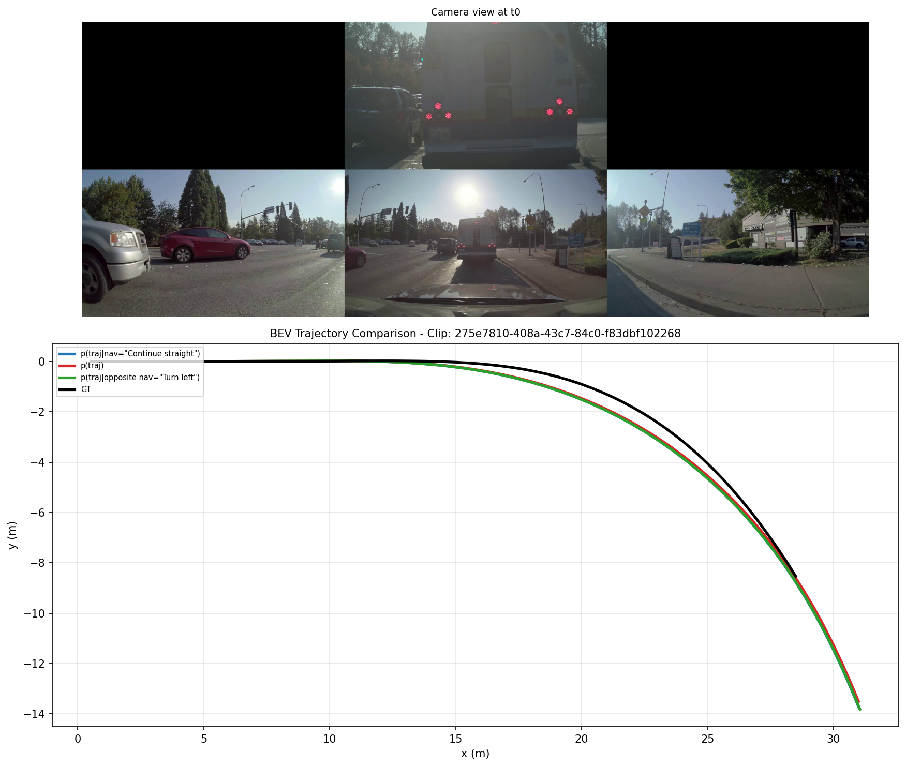

**Read this in other languages: [English](README.md), [中文](README_zh.md).**

# Alpamayo-1.5-Local (VLA Model End-to-End Autonomous Driving Local Reproduction & Evaluation System)

This project is a fully local and offline reproduction of NVIDIA's Vision-Language-Action (VLA) end-to-end driving model, **Alpamayo-1.5**. Developed primarily during my internship, this repository **features an ablation study on multi-camera configurations**, addressing the cloud-dependency issues of the original model. Through systematic ablation studies on camera combinations, it validates the contribution of different perspectives to trajectory prediction accuracy. It achieves a fully localized pipeline from multimodal dataset processing, end-to-end inference, trajectory evaluation, to BEV (Bird's-Eye View) visualization.

## 🌟 Core Contributions & Highlights (Internship Highlights)

*   **Local & Offline Inference Deployment**: Successfully decoupled the Alpamayo-1.5 10B VLA model and its dataloaders (e.g., PhysicalAI Autonomous-Vehicles dataset) from online dependencies, enabling fully local offline inference.
*   **Multi-camera Ablation Experiment (Core Research)**:
    *   Evaluated the contribution of each perspective to trajectory prediction accuracy through systematic runs of different camera configurations (1-cam, 2-cam, 4-cam, panoramic 7-cam, etc.).
    *   **Ablation Methodology**: Fixed model weights, only changed camera input parameters, and comparatively analyzed the importance of each camera via ADE metrics.
    *   **Research Outcomes**: Quantified the contribution of individual cameras, the marginal benefits of multi-camera fusion, and the trade-off between cost and accuracy.
    *   Supports dynamic configuration of multi-camera perspectives, evaluated in combination with vehicle Egomotion historical information and text navigation instructions.
*   **End-to-End Trajectory Prediction & Evaluation Framework**:
    *   Constructed complete inference scripts (inference_ade.py, inference_vitz.py, etc.).
    *   Implemented contrastive functionalities between predicted and ground truth trajectories, introducing the rigorous **minADE_6** metric to quantify prediction accuracy.
    *   Introduced language instruction conditioning to evaluate the model's obedience to normal vs. counterfactual (Swapped) instructions.
*   **Bird's-Eye View (BEV) Visualization Engine**: Developed a matplotlib-based BEV visualization verification tool. It seamlessly projects raw multi-view camera images, output 6-modal trajectories, GT historical paths, and instruction-conditioned pathways onto a BEV plane for intuitive debugging and demonstrations.
*   **Infrastructure for Future Extensions**: The codebase is architecturally prepared for advanced paradigms, including subsequent Model Fine-tuning, RL fine-tuning, and Consistency Training.

## 📊 Evaluation & Visualization (Visualization)

| Parameter         | Value                                  |
|-------------------|----------------------------------------|
| clip‑id         | eed514a0‑a366‑4550‑b9bd‑4c296c531511 |
| 	0‑us           | 10000000                             |

| Inference Result  | Value                                  |
|-------------------|----------------------------------------|
| Chain-of-Thought  | *Adapt speed for the left curve ahead* |
| **minADE_6**      | **1.8058 m**                           |

*(Example of BEV Trajectory comparison incorporating camera views, predicted paths, and annotations)*

## 🛠 Project Structure (Project Structure)

This project is the **Alpamayo-1.5 multi-camera ablation experiment evaluation system**, analyzing the contribution of each camera to trajectory prediction accuracy through combinations of different camera configurations.

Core module distribution:
- lpamayo1_5/: Core inference dependencies including the VLA model architecture, Token-Processors, physical coordinate transformations, and geometric helpers.
- dataset.py / load_physical_aiavdataset.py: Decodes and interfaces with the multimodal PhysicalAI offline dataset.
- inference_ade.py: **Main execution file**. Performs inference, generates coordinate predictions, computes ADE metrics, and coordinates the BEV visualization tool.
- 
un_multiple_clips.py / launch_parallel.py: Scripts supporting batch testing pipelines for multiple video clips.
- iz_utils.py: Code implementation for BEV trajectory rendering and multi-camera grid projection.

## 🔬 Detailed Ablation Experiment Results (Ablation Experiment Results)

This experiment is based on **a sample of 10 chunks from Alpamayo-1.5, totaling 1000 clips**. By fixing model weights and only altering camera input configurations, it systematically evaluates each camera's contribution to trajectory prediction accuracy.

### Experimental Setup & Label Definition

Scene labels are directly parsed from the future ground truth physical trajectories of the ego vehicle. By assessing whether the lateral (Y-axis) offset at the final frame exceeds 2.5 meters, scenes are automatically classified as straight-going, left-turning, or right-turning. *(Note: Boundary errors may exist)*

### Core Experimental Findings

#### 1️⃣ **Optimal 4-Camera Configuration**
- **4cam baseline (front-wide + front-tele + cross-left + cross-right)**
- **minADE: 0.927m** ✓ Optimal setup
- Includes forward wide, forward telephoto, left, and right perspective cameras.
- Serves as the golden configuration for autonomous trajectory prediction.

#### 2️⃣ **Camera Quantity vs. Performance**

- **1-cam → 4-cam**: Performance improves continuously.
- Indicates that **both forward and lateral perspectives possess irreplaceable contributions to planning tasks**.
- Multi-camera fusion yields significant synergistic effects.

#### 3️⃣ **Evaluation of Rear-View Replacement Strategies**
All three rear-view replacement strategies perform significantly worse than the 4cam baseline:

| Strategy | Replacement Policy | minADE | Assessment |
|----------|-------------------|--------|------------|
| **4rt** | Replace front-tele with rear | 2.707m | Severe degradation (The only one worse than 1-cam baseline) |
| **4rl** | Replace cross-left with rear-left | Performance drops | Retains some valid information |
| **4rr** | Replace cross-right with rear-right | Performance drops | Retains some valid information |

**Conclusion**: Replacing front-tele with a rear camera **causes massive performance loss**, but it's not entirely useless—4rl and 4rr still retain some valid information, though nowhere near the contribution of front-tele to planning.

#### 4️⃣ **Counter-intuitive Finding for Panoramic 7-Camera Setup**

- **Adding all 7 cameras actually degraded performance down to 1.376m.**
- Suggests that **rear-view information acts as noise for forward planning tasks.**
- Performance decreased by 48.3% compared to the 4cam baseline (0.927m).

**Key Insight**:
`
Different cameras bear different functional weights → The design foundation for differentiated camera processing architectures

✓ front-wide + front-tele: Main forward view (Detailed observation)
✓ cross-left + cross-right: Auxiliary lateral views (Spatial understanding)
✗ rear cameras: Noise information (No practical contribution to forward planning)
`

### Overall Ablation Conclusion

| Dimension | Discovery | Implication |
|-----------|-----------|-------------|
| **Optimal Setup** | 4cam (0.927m) | Best Cost-Performance ratio |
| **Fusion Edge** | Synergy between forward & lateral views | Necessity of multi-camera engineering |
| **Marginal Returns** | Adding more cameras offers diminishing returns | There exists an optimal upper-bound setup |
| **Noise Issue** | Rear-view information creates interference | Requires **differentiated processing strategies** |

---

## 🎯 Research Outcomes & Deployment Suggestions

### Practical Application Implications

1. **Camera Selection**: Prioritize forward dual-lenses (wide + telephoto) + left & right laterals, avoiding redundant rear-view cameras.
2. **Architecture Design**: Design **differentiated feature extraction and fusion modules** for varying perspectives rather than generic processing.
3. **Cost Optimization**: While meeting accuracy requirements (~0.95m minADE), the 4-camera setup is the optimal cost-effective point.
4. **Model Improvement**: Future work can explore **adaptive camera weight learning** to dynamically adjust perspective contributions.

---

## 🚀 Quick Start (Quick Start)

### 1. Environment Setup

Anaconda is recommended:
`ash
# Recommended environment
python == 3.12
CUDA Toolkit support (e.g., CUDA 12.1)
`

Clone the repository and prepare the local environment:
`ash
git clone https://github.com/IP127000/Alpamayo-VLA-Local.git
cd Alpamayo-VLA-Local
pip install -r requirements.txt
`

### 2. Dataset Setup
You do not need to download the full [NVIDIA PhysicalAI Dataset](https://huggingface.co/datasets/nvidia/PhysicalAI-Autonomous-Vehicles). To run testing, simply ensure you have some local clips and their corresponding sensor extrinsics/intrinsics Parquet files.

### 3. Local Inference & Evaluation
You can run inferences and visualizations directly using the evaluation script for a single clip:
`ash
python inference_ade.py \
    --clip-id 275e7810-408a-43c7-84c0-f83dbf102268 \
    --cameras-config 4_cam \
    --visualize 
`
Upon completion, the terminal will print the generated multimodal text and the minADE_6 metric error result. Additionally, an analyzed visualization consisting of multi-camera screens merged with the BEV contrast trajectory (ev_trajectory.png) will be generated.

---

## 📌 Project Relationship (Project Relationship)

**Alpamayo-Reproduction-Moe encompasses two independent research directions**:

| Project | Base Model | Research Content | Directory | Research Phase |
|---------|------------|------------------|-----------|----------------|
| **Trajectory MoE** | R1 | Decoder-layer MoE architectural design | 	rajectory_moe/ | Architectural Innovation |
| **Camera Ablation** | 1.5 | Systematic ablation of multi-cam setups | cemare_moe/ (This project) | **Ablation Study** |

This project (cemare_moe/) is the **Alpamayo-1.5 multi-camera ablation experiment system**. By evaluating and running combinations of different camera parameters while comparing ADE metrics, it quantifies each camera's contribution to trajectory prediction precision, providing data support for practical deployments.

---
**Welcome to Star!**
If you are interested in VLM/VLA-based end-to-end autonomous driving, or if this codebase has been helpful, please leave a ⭐ to support us. More source codes for model fine-tuning and alignment training will be released soon!
